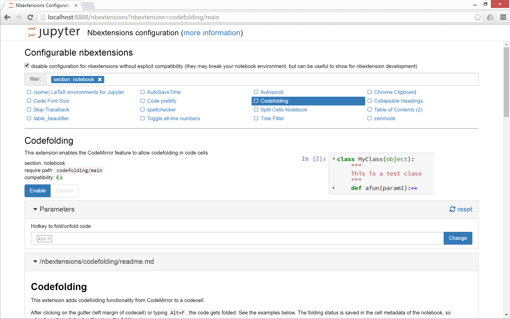
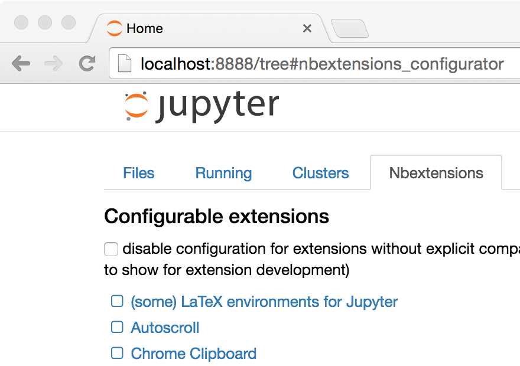

Jupyter Nbextensions Configurator
=================================

[](https://gitter.im/jupyter-contrib/jupyter_nbextensions_configurator?utm_source=badge&utm_medium=badge&utm_campaign=pr-badge&utm_content=badge)
[](https://github.com/jupyter-contrib/jupyter_nbextensions_configurator/issues)
<br/>
[](https://travis-ci.org/Jupyter-contrib/jupyter_nbextensions_configurator)
[](https://ci.appveyor.com/project/jcb91/jupyter-nbextensions-configurator-ixdb9)
<br/>
[](https://coveralls.io/github/Jupyter-contrib/jupyter_nbextensions_configurator)
[](https://codecov.io/gh/Jupyter-contrib/jupyter_nbextensions_configurator)
<br/>
[](https://github.com/jupyter-contrib/jupyter_nbextensions_configurator)
[](https://pypi.python.org/pypi/jupyter_nbextensions_configurator)
[](https://anaconda.org/conda-forge/jupyter_nbextensions_configurator)


A server extension for [jupyter notebook](https://github.com/jupyter/notebook)
which provides configuration interfaces for notebook extensions (nbextensions).

The `jupyter_nbextensions_configurator` jupyter server extension provides
graphical user interfaces for configuring which nbextensions are enabled
(load automatically for every notebook), and display their readme files.
In addition, for nbextensions which include an appropriate yaml descriptor file
(see below), the interface also provides controls to configure the
nbextensions' options.

This project was spun out of work from
[`ipython-contrib/IPython-notebook-extensions`][contrib repo url].

[contrib repo url]: https://github.com/ipython-contrib/IPython-notebook-extensions


Usage
-----

Once `jupyter_nbextensions_configurator` is installed and enabled, and your
notebook server has been restarted, you should be able to find the nbextensions
configuration interface at the url `<base_url>nbextensions`, where
`<base_url>` is described below (for simple installs, it's usually just `/`, so
the UI is at `/nbextensions`).




### base_url

For most single-user notebook servers, the dashboard (the file-browser or
'tree' view) is at

    http://localhost:8888/tree

So the `base_url` is the part between the host (`http://localhost:8888`) and
`tree`, so in this case it's the default value of just `/`.
If you have a non-default base url (such as with JupyterHub), you'll need to
prepend it to the url. So, if your dashboard is at

    http://localhost:8888/custom/base/url/tree

then you'll find the configurator UI page at

    http://localhost:8888/custom/base/url/nbextensions


### tree tab

In addition to the main standalone page, the nbextensions configurator
interface is also available as a tab on the dashboard:



The dashboard tab is provided via an nbextension called
"Nbextensions dashboard tab", with requirejs uri
`nbextensions_configurator/tree_tab/main`.
Since version [0.2.0](#020), this nbextension is enabled by default on enabling
the `jupyter_nbextensions_configurator` serverextension, but it can be disabled
as with any other nbextension if you don't want to use it.


### edit menu item

`jupyter_nbextensions_configurator` provides a second small nbextension, which
simply adds an item to the notebook-view edit menu, which links to the
configurator UI page:


Similarly to the tree tab nbextension detailed above, since version
[0.2.0](#020), the edit menu item nbextension is enabled by default when
enabling the main `jupyter_nbextensions_configurator` serverextension, but can
be disabled at any time in the same way as other nbextensions.


YAML file format
----------------

You don't need to know about the yaml files in order simply to use
`jupyter_nbextensions_configurator`.
An nbextension is 'found' by the `jupyter_nbextensions_configurator` server
extension when a special yaml file describing the nbextension and its options
is found in the notebook server's `nbextensions_path`.
The yaml file can have any name with the file extension `.yaml` or `.yml`, and
describes the nbextension and its options to
`jupyter_nbextensions_configurator`.

The case-sensitive keys in the yaml file are as follows:

 * `Type`,            (**required**) a case-sensitive identifier, must be `IPython Notebook Extension` or `Jupyter Notebook Extension`
 * `Main`,            (**required**) the main javascript file that is loaded, typically `main.js`
 * `Name`,            the name of the nbextension
 * `Section`,         which view the nbextension should be loaded in (defaults to `notebook`, but can alternatively be `tree`, `edit`, or to load in all views, `common`).
 * `Description`,     a short explanation of the nbextension
 * `Link`,            a URL for more documentation. If this is a relative url with a `.md` file extension (recommended!), the markdown readme is rendered in the configurator UI.
 * `Icon`,            a URL for a small icon for the configurator UI (rendered 120px high, should preferably end up 400px wide. Recall HDPI displays may benefit from a 2x resolution icon).
 * `Compatibility`,   Jupyter major version compatibility, e.g. `3.x` or `4.x`, `3.x 4.x`, `3.x, 4.x, 5.x`
 * `Parameters`,      an optional list of configuration parameters. Each item is a dictionary with (some of) the following keys
   * `name`,          (**required**) the name used to store the configuration variable in the config json. It follows a json-like structure, so you can use `.` to separate sub-objects e.g. `myextension.buttons_to_add.play`.
   * `description`,   a description of the configuration parameter
   * `default`,       a default value used to populate the tag in the configurator UI, if no value is found in config. Note that this is more of a hint to the user than anything functional - since it's only set in the yaml file, the javascript implementing the nbextension in question might actually use a different default, depending on the implementation.
   * `input_type`,    controls the type of html tag used to render the parameter in the configurator UI. Valid values include `text`, `textarea`, `checkbox`, [html5 input tags such as `number`, `url`, `color`, ...], plus a final type of `list`
   * `list_element`,  a dictionary with the same `default` and `input_type` keys as a `Parameters` entry, used to render each element of the list for parameters with input_type `list`
   * finally, extras such as `min`, `step` and `max` may be used by `number` tags for validation
* `tags`,             a list of string tags describing the nbextension, to allow for filtering

Example:

```yaml
Type: Jupyter Notebook Extension
Name: Limit Output
Section: notebook
Description: This nbextension limits the number of characters that can be printed below a codecell
tags:
- usability
- limit
- output
Link: readme.md
Icon: icon.png
Main: main.js
Compatibility: 4.x
Parameters:
- name: limit_output
  description: Number of characters to limit output to
  input_type: number
  default: 10000
  step: 1
  min: 0
- name: limit_output_message
  description: Message to append when output is limited
  input_type: text
  default: '**OUTPUT MUTED**'
```


Troubleshooting
---------------

If you encounter problems with this server extension, you can:
 * check the [issues page][this repo issues] for the [github repository][this repo].
   If you can't find one that fits your problem, please create a new one!
 * ask in the project's [gitter chatroom][gitter url]

For debugging, useful information can (sometimes) be found by:

 * Checking for error messages in the browser's [JavaScript console][javascript console howto].
 * Checking for messages in the notebook server's logs. This is particularly
   useful when the server is run with the `--debug` flag, to get as many logs
   as possible.

[this repo]: https://github.com/jupyter-contrib/jupyter_nbextensions_configurator
[this repo issues]: https://github.com/jupyter-contrib/jupyter_nbextensions_configurator/issues
[gitter url]: https://gitter.im/jupyter-contrib/jupyter_nbextensions_configurator
[javascript console howto]: webmasters.stackexchange.com/questions/8525/how-to-open-the-javascript-console-in-different-browsers
